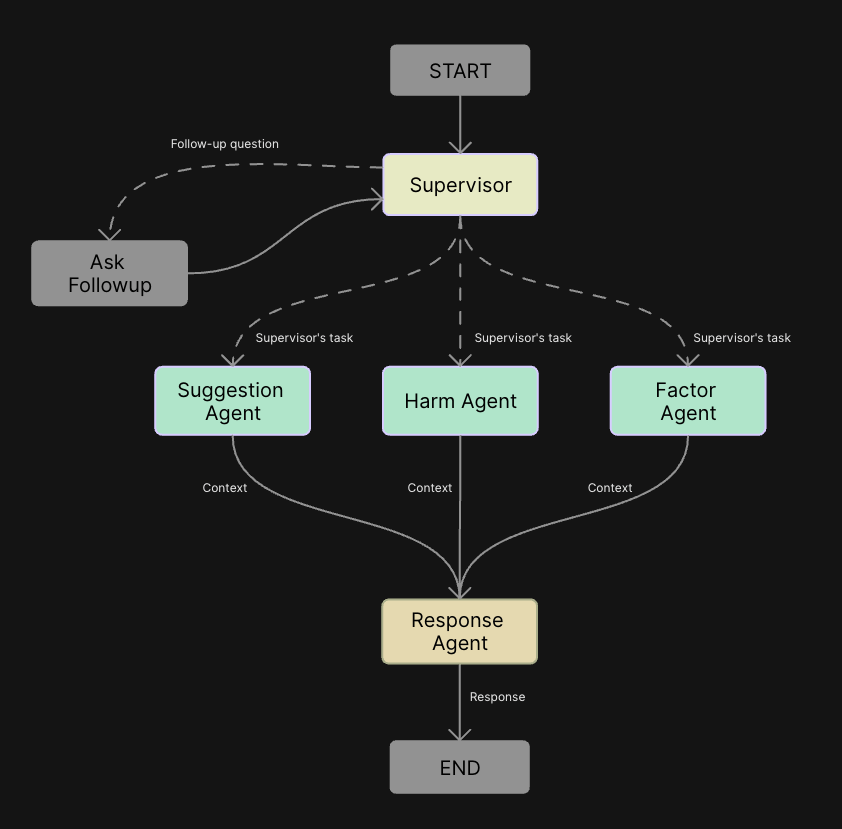
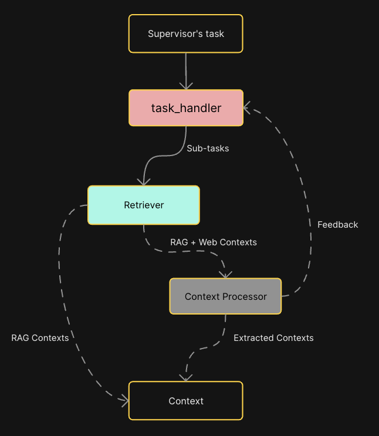

<h1 align="center"><b>SomniFlow: Multi-Agent Chatbot System for Insomnia</b></h1>

### Table of Contents
- [Quick Start](#quick-start)
  - [Demo](#demo)
  - [Architecture](#architecture)
- [Introduction](#introduction)
- [Key Features](#key-features)
- [Usage](#usage)
  - [Prerequisites](#prerequisites)
  - [Setup](#setup)
- [Project Structure](#project-structure)

## Quick Start
### Demo
https://github.com/user-attachments/assets/413d4cd2-e8a5-4d1a-bab7-1813b4cdfd5f

### Architecture

<div align="center">
  <table>
    <tr>
      <td align="center">
        
        <br>
        <em>Figure 1: High-level system architecture</em>
      </td>
      <td align="center">
        
        <br>
        <em>Figure 2: Detailed flow of information between specialized agents</em>
      </td>
    </tr>
  </table>
</div>

SomniFlow uses a multi-agent architecture where specialized agents collaborate to process user queries, retrieve information, and generate insightful, context-aware responses.

## Introduction

**SomniFlow** is an advanced multi-agent chatbot system designed to assist users with insomnia-related queries. It leverages LangGraph for orchestrating complex agent workflows and PydanticAI for type-safe LLM interactions. The system is built to provide comprehensive, evidence-based, and context-aware responses by combining local knowledge, real-time web search, and collaborative agent reasoning.

## Key Features
- **Perplexity-inspired UI**: The frontend is heavily inspired by the Perplexity AI interface, offering a clean, modern chat experience. It supports:
  - Streaming of intermediate workflow steps (e.g., planning, retrieval, evaluation)
  - Real-time streaming of tokens as the answer is generated
  - Visual timeline of agent actions and retrieval steps
  - Tabbed views for answers, sources, and workflow tasks
- **Multi-agent architecture**: Specialized agents (Supervisor, Suggestion, Harm, Factor, Response) work together:
  - **Supervisor**: Plans and delegates tasks to other agents based on user input and context
  - **Suggestion**: Provides actionable recommendations for insomnia
  - **Harm**: Assesses potential harms and negative effects
  - **Factor**: Identifies contributing factors
  - **Response**: Synthesizes and delivers the final answer
- **Retrieval-Augmented Generation (RAG)**: Integrates a local vector database (Qdrant) to retrieve relevant information from curated knowledge bases
- **Web search integration**: Uses SearXNG for real-time web search, with semantic ranking and snippet extraction for up-to-date information
- **Streaming backend**: The FastAPI backend streams both intermediate steps and answer tokens to the frontend, enabling a transparent, interactive experience
- **Contextual understanding**: Agents collaborate and share context, ensuring nuanced, well-rounded responses
- **Modern tech stack**: FastAPI backend, Next.js frontend, LangGraph, PydanticAI, and robust Docker-based infrastructure

## Usage

### Prerequisites
1. Docker installed for running Qdrant and SearXNG
2. Python 3.12+ for the backend
3. Node.js for the frontend

### Setup
1. Start Redis:
```bash
docker run -p 6379:6379 -d redis
```

2. Start the Qdrant vector database:
```bash
docker run -p 6333:6333 -p 6334:6334 -v "$(pwd)/qdrant_storage:/qdrant/storage:z" qdrant/qdrant
```

3. Start the SearXNG search engine:
```bash
docker run --rm -d -p 8080:8080 -v ./config/searxng-settings.yml:/etc/searxng/settings.yml -e "BASE_URL=http://localhost:8080/" -e "INSTANCE_NAME=my-instance" searxng/searxng
```

4. Install backend dependencies:
```bash
uv sync
```

5. Start the FastAPI backend server:
```bash
source .venv/bin/activate
uvicorn backend.main:app --reload
```

6. In a separate terminal, navigate to the frontend directory and install dependencies:
```bash
cd my-frontend
npm install
```

7. Start the Next.js frontend:
```bash
npm run dev
```


Convert PDFs to JSON:
```bash
python run_data_pipeline.py convert-pdfs <input_folder> --output-root <output_folder>
```

Extract metadata from JSONs
```bash
python run_data_pipeline.py extract-metadata <input_folder>
```


8. Open your browser and navigate to http://localhost:3000 to use SomniFlow

## Project Structure

```
multi-agent-chatbot-system-for-insomnia/
├── config/                          # Configuration files
├── src/
│   ├── agents/                      # Multi-agent system components
│   │   ├── base/                    # Base classes and shared models
│   │   ├── factor/                  # Factor analysis agent
│   │   ├── harm/                    # Harm assessment agent
│   │   ├── response/                # Response generation agent
│   │   ├── suggestion/              # Suggestion generation agent
│   │   └── supervisor/              # Main supervisor agent
│   ├── common/                      # Shared utilities
│   │   ├── llm/                     # LLM integration
│   │   └── logging/                 # Logging setup
│   ├── graph/                       # LangGraph workflow
│   ├── lmchunker/                   # Language model chunking
│   └── tools/                       # Various tools
│       ├── utils/                   # Utility functions
│       ├── rag/                     # Retrieval-augmented generation
│       └── web/                     # Web-related tools
│           ├── scraper/             # Web scraping functionality
│           └── search/              # Web search functionality
├── main.py                          # FastAPI server entry point
└── vectorstore.py                   # Vector store operations
```
