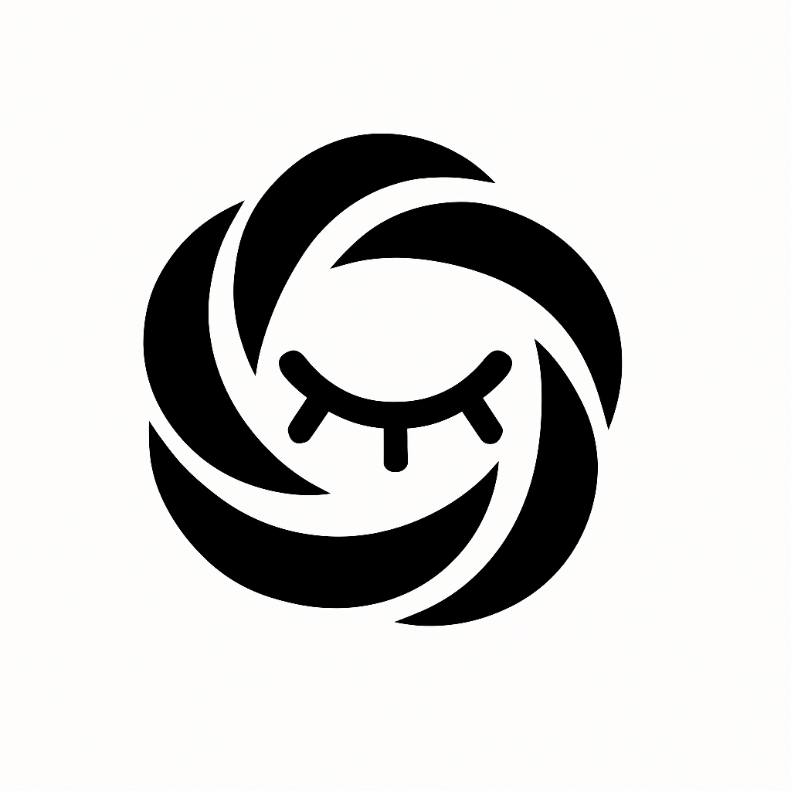
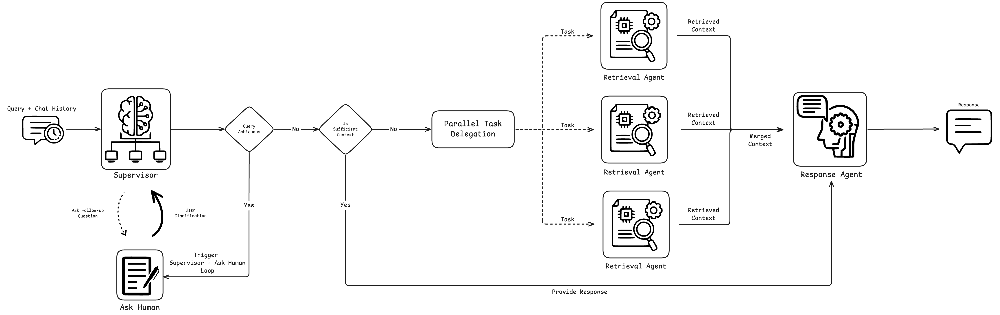
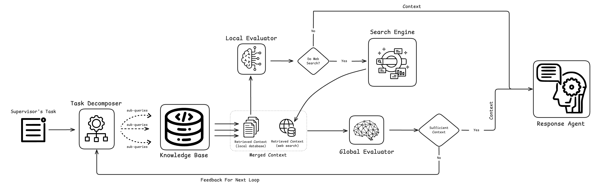

<div align="center">
  
  <h1>SomniFlow</h1>
  <p><strong>Multi-Agent Chatbot System for Insomnia</strong></p>
  <p><em>An advanced multi-agent chatbot system designed to assist users with insomnia-related queries</em></p>
</div>

<div align="center">
  <a href="https://www.python.org/downloads/"></a>
  <a href="https://fastapi.tiangolo.com/"></a>
  <a href="https://nextjs.org/"></a>
  <a href="https://github.com/langchain-ai/langgraph"></a>
  <a href="https://github.com/crawl4ai/crawl4ai"></a>
  <a href="https://github.com/docling-ai/docling"></a>
</div>

## 📋 Table of Contents

- [🚀 Quick Start](#-quick-start)
- [🎯 Introduction](#-introduction)
- [✨ Key Features](#-key-features)
- [🏗️ Architecture](#️-architecture)
- [📦 Installation](#-installation)
- [🔧 Configuration](#-configuration)
- [🚀 Usage](#-usage)
- [📚 Documentation](#-documentation)

## 🚀 Quick Start

### Live Demo
[Watch the demo video](https://github.com/user-attachments/assets/c86b79a7-9868-4fbb-9daf-1cb7135bf0be)

### Quick Setup (5 minutes)

1. **Clone the repository**
   ```bash
   git clone https://github.com/TaiQuach123/SomniFlow.git
   cd SomniFlow
   ```

2. **Start required services with Docker**
   ```bash
   # Start Redis
   docker run -p 6379:6379 -d redis
   
   # Start Qdrant vector database
   docker run -p 6333:6333 -p 6334:6334 -v "$(pwd)/qdrant_storage:/qdrant/storage:z" qdrant/qdrant
   
   # Start SearXNG search engine
   docker run --rm -d -p 8080:8080 \
     -v ./config/searxng-settings.yml:/etc/searxng/settings.yml \
     -e "BASE_URL=http://localhost:8080/" \
     -e "INSTANCE_NAME=somniflow" \
     searxng/searxng
   ```

3. **Install and start the backend**
   ```bash
   uv sync
   source .venv/bin/activate
   uvicorn backend.main:app --reload
   ```

4. **Install and start the frontend**
   ```bash
   cd my-frontend
   npm install
   npm run dev
   ```

5. **Open your browser**
   Navigate to [http://localhost:3000](http://localhost:3000) to start using SomniFlow!

## 🎯 Introduction

**SomniFlow** is an advanced multi-agent chatbot system specifically designed to assist users with insomnia-related queries. Built with cutting-edge AI technologies, it provides comprehensive, evidence-based, and context-aware responses by combining local knowledge, real-time web search, and collaborative agent reasoning.

### What Makes SomniFlow Special?

- **🤖 Multi-Agent Intelligence**: Five specialized AI agents work together to provide comprehensive insomnia assistance
- **🔍 Real-Time Research**: Combines local knowledge with live web search for up-to-date information
- **💬 Natural Conversations**: Perplexity-inspired interface with streaming responses and transparent workflow
- **🎯 Specialized Focus**: Expert-level knowledge specifically for sleep disorders and insomnia management

## ✨ Key Features

### 🎨 Modern User Interface
- **Perplexity-inspired design** with clean, intuitive chat experience
- **Real-time streaming** of both intermediate steps and final answers
- **Visual timeline** showing agent actions and retrieval steps
- **Tabbed interface** for answers, sources, and workflow tasks
- **Mobile-responsive** design for use on any device

### 🤖 Multi-Agent Architecture
- **Supervisor Agent**: Orchestrates and delegates tasks to specialized agents
- **Suggestion Agent**: Provides actionable recommendations for insomnia management
- **Harm Assessment Agent**: Evaluates potential risks and side effects
- **Factor Analysis Agent**: Identifies contributing factors to sleep issues
- **Response Agent**: Synthesizes information into comprehensive answers

### 🔍 Advanced Search & Retrieval
- **RAG Integration**: Local vector database (Qdrant) for curated knowledge retrieval
- **Web Search**: Real-time information via SearXNG with semantic ranking
- **Context Awareness**: Agents share context for nuanced, well-rounded responses
- **Source Attribution**: Transparent citation of information sources

### ⚡ Technical Excellence
- **FastAPI Backend**: High-performance, async API with streaming support
- **Next.js Frontend**: Modern React framework with TypeScript
- **LangGraph Workflows**: Sophisticated agent orchestration
- **PydanticAI**: Type-safe LLM interactions
- **Docker Infrastructure**: Easy deployment and scaling

## 🏗️ Architecture

<div align="center">
  
  <br>
  <em>Figure 1: High-level system architecture</em>
  <br><br>
  
  <br>
  <em>Figure 2: Detailed flow of information within retrieval agents</em>
</div>

SomniFlow uses a sophisticated multi-agent architecture where specialized agents collaborate to process user queries, retrieve information, and generate insightful, context-aware responses.

### System Components

1. **Frontend Layer**: Next.js application with streaming UI
2. **API Gateway**: FastAPI backend handling requests and streaming responses
3. **Agent Orchestration**: LangGraph managing multi-agent workflows
4. **Knowledge Base**: Qdrant vector database for local knowledge retrieval
5. **Web Search**: SearXNG for real-time information gathering
6. **Caching**: Redis for session management and response caching

## 📦 Installation

### Prerequisites

- **Docker** (for Qdrant, SearXNG, and Redis)
- **Python 3.12+** (for backend)
- **Node.js 18+** (for frontend)
- **Git** (for cloning the repository)

### Step-by-Step Installation

#### 1. Clone the Repository
```bash
git clone https://github.com/yourusername/somniflow.git
cd somniflow
```

#### 2. Set Up Backend Environment
```bash
# Install Python dependencies using uv
uv sync

# Activate virtual environment
source .venv/bin/activate
```

#### 3. Set Up Frontend Environment
```bash
cd my-frontend
npm install
```

#### 4. Start Required Services
```bash
# Start Redis for caching
docker run -p 6379:6379 -d redis

# Start Qdrant vector database
docker run -p 6333:6333 -p 6334:6334 \
  -v "$(pwd)/qdrant_storage:/qdrant/storage:z" \
  qdrant/qdrant

# Start SearXNG search engine
docker run --rm -d -p 8080:8080 \
  -v ./config/searxng-settings.yml:/etc/searxng/settings.yml \
  -e "BASE_URL=http://localhost:8080/" \
  -e "INSTANCE_NAME=somniflow" \
  searxng/searxng
```

#### 5. Start the Application
```bash
# Terminal 1: Start backend
source .venv/bin/activate
uvicorn backend.main:app --reload --host 0.0.0.0 --port 8000

# Terminal 2: Start frontend
cd my-frontend
npm run dev
```

#### 6. Access the Application
Open your browser and navigate to [http://localhost:3000](http://localhost:3000)

## 🔧 Configuration

### Environment Variables

Create a `.env` file in the root directory:

```bash
# Backend Configuration
SEARXNG_API_URL="http://localhost:8080"


HF_TOKEN=
GROQ_API_KEY=
LOGFIRE_API_KEY=
JINA_API_KEY=
GEMINI_API_KEY=


JWT_SECRET=
JWT_ALGORITHM="HS256"
ACCESS_TOKEN_EXPIRE_MINUTES=30
REFRESH_TOKEN_EXPIRE_DAYS=7

DATABASE_NAME=
HOSTNAME=
USERNAME=
PASSWORD=
POSTGRES_DB_URL=
ASYNC_POSTGRES_DB_URL=
REDIS_HOST="localhost"
REDIS_PORT=6379


GOOGLE_CLIENT_ID=
GOOGLE_CLIENT_SECRET=
GOOGLE_ACCESS_TOKEN_URL=https://oauth2.googleapis.com/toke
GOOGLE_AUTHORIZE_URL=https://accounts.google.com/o/oauth2/auth
GOOGLE_API_BASE_URL=https://www.googleapis.com/oauth2/v2/
GOOGLE_USERINFO_ENDPOINT=https://openidconnect.googleapis.com/v2/userinfo
SESSION_SECRET_KEY=
```

### Service Configuration

#### Qdrant Configuration
The vector database is automatically configured when started with Docker. Data is persisted in the `qdrant_storage` directory.

#### SearXNG Configuration
Search engine settings are configured in `config/searxng-settings.yml`. Modify this file to customize search behavior.

## 🚀 Usage

### Basic Usage

1. **Start a Conversation**: Type your insomnia-related question in the chat interface
2. **Watch the Process**: Observe the real-time workflow as agents collaborate
3. **Review Results**: Check the tabs for answers, sources, and detailed workflow
4. **Ask Follow-ups**: Continue the conversation with related questions

### Example Queries

- "What are the best natural remedies for insomnia?"
- "How does blue light affect sleep quality?"
- "What are the side effects of melatonin supplements?"
- "How can I create a better sleep environment?"
- "What causes sleep anxiety and how can I manage it?"

### Document Processing Pipeline

SomniFlow includes a comprehensive document processing pipeline for adding custom knowledge:

#### Parse PDFs to JSON
```bash
python run_doc_pipeline.py --step parse-pdfs \
  --input_dir ./documents \
  --output_dir ./processed
```

#### Extract Metadata
```bash
python run_doc_pipeline.py --step generate-metadata \
  --input_dir ./processed \
  --output_dir ./metadata
```

#### Chunk Documents
```bash
python run_doc_pipeline.py --step chunk-documents \
  --input_dir ./metadata \
  --output_dir ./chunks
```

#### Full Processing Pipeline
```bash
python run_doc_pipeline.py --step all \
  --input_dir ./documents \
  --output_dir ./processed
```

#### Upload to Vector Store
```bash
python bulk_upload_chunks.py ./chunks
```

### Advanced Features

- **Session Management**: Conversations are automatically saved and can be resumed
- **Source Verification**: All information is attributed to reliable sources
- **Custom Knowledge**: Add your own documents to the knowledge base
- **Export Conversations**: Download chat history for reference

## 📚 Documentation

### API Documentation

Once the backend is running, visit [http://localhost:8000/docs](http://localhost:8000/docs) for interactive API documentation.


## 🏗️ Project Structure

```
somniflow/
├── 📁 assets/                       # Images and static assets
├── 📁 backend/                      # FastAPI backend application
│   ├── 📁 api/                      # API routes and handlers
│   ├── 📁 auth/                     # Authentication system
│   └── main.py                      # FastAPI application entry point
├── 📁 config/                       # Configuration files
│   ├── logging_dict_config.json     # Logging configuration
│   └── searxng-settings.yml         # SearXNG search engine settings
├── 📁 my-frontend/                  # Next.js frontend application
│   ├── 📁 app/                      # Next.js app directory
│   ├── 📁 components/               # React components
│   ├── 📁 hooks/                    # Custom React hooks
│   └── 📁 lib/                      # Utility libraries
├── 📁 src/                          # Core application logic
│   ├── 📁 agents/                   # Multi-agent system components
│   │   ├── 📁 base/                 # Base classes and shared models
│   │   ├── 📁 factor/               # Factor analysis agent
│   │   ├── 📁 harm/                 # Harm assessment agent
│   │   ├── 📁 response/             # Response generation agent
│   │   ├── 📁 suggestion/           # Suggestion generation agent
│   │   └── 📁 supervisor/           # Main supervisor agent
│   ├── 📁 common/                   # Shared utilities
│   │   ├── 📁 llm/                  # LLM integration
│   │   └── 📁 logging/              # Logging setup
│   ├── 📁 doc_pipeline/             # Document processing pipeline
│   ├── 📁 graph/                    # LangGraph workflow definitions
│   └── 📁 tools/                    # Various tools and utilities
│       ├── 📁 rag/                  # Retrieval-augmented generation
│       ├── 📁 utils/                # Utility functions
│       └── 📁 web/                  # Web scraping and search tools
├── 📄 pyproject.toml                # Python project configuration
├── 📄 uv.lock                       # Dependency lock file
├── 📄 run_doc_pipeline.py           # Document processing script
├── 📄 bulk_upload_chunks.py         # Vector store upload script
└── 📄 README.md                     # This file
```

## 🙏 Acknowledgments

- [LangGraph](https://github.com/langchain-ai/langchain) for the multi-agent framework
- [Perplexity AI](https://perplexity.ai/) for UI inspiration
- [FastAPI](https://fastapi.tiangolo.com/) for the backend framework
- [Next.js](https://nextjs.org/) for the frontend framework


